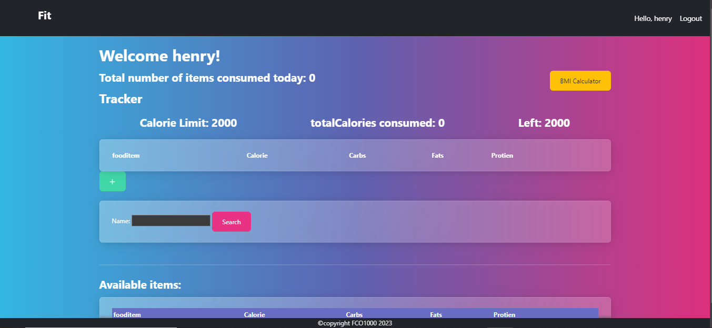
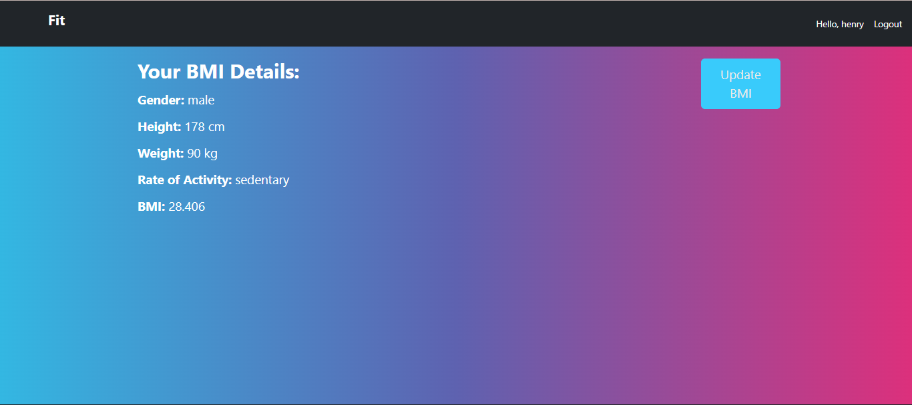
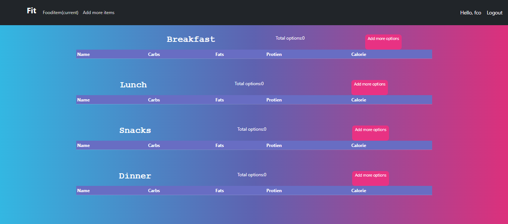

# This is my Calorie Counter project
# Calorie Calculator App

 Home page

The Calorie Calculator App is a web application that allows users to track their calorie intake and monitor their daily consumption. It provides features for managing food items, calculating total calories, and setting calorie limits. The app also includes a BMI (Body Mass Index) calculator to help users track their body fitness.

## Features

- User authentication: Users can sign up, log in, and log out to access their personal calorie tracking information.
- Calorie tracking: Users can add food items they consume throughout the day, track the calories, and view a summary of their daily consumption.
- Calorie limits: Users can set calorie limits and monitor their progress towards the set goals.
- BMI calculator: Users can calculate their BMI using the provided height and weight inputs.

## Sreenshots
BMI page

sign up page

food items page(admin only)

## Technologies Used

- Django: A high-level Python web framework used for rapid development and clean design.
- HTML/CSS: Front-end technologies used for building the user interface and styling.
- Bootswatch: A modified bootstrap CSS framework used for responsive and mobile-first web development.

## Installation

1. Clone the repository: `git clone <repository-url>`
2. Install the required dependencies: `pip install -r requirements.txt`
3. Set up the database:
   - Apply database migrations: `python manage.py migrate`
4. Start the development server: `python manage.py runserver`
5. Access the application in your web browser: `http://localhost:8000/`

## Usage

- Create an account or log in to an existing account.
- Set your calorie limits and track your daily food intake.
- Use the BMI calculator to calculate your BMI based on your height and weight.
- Monitor your progress and make adjustments to your calorie intake as needed.

## License

The Calorie Calculator App is open-source software licensed under the [MIT license](LICENSE).
